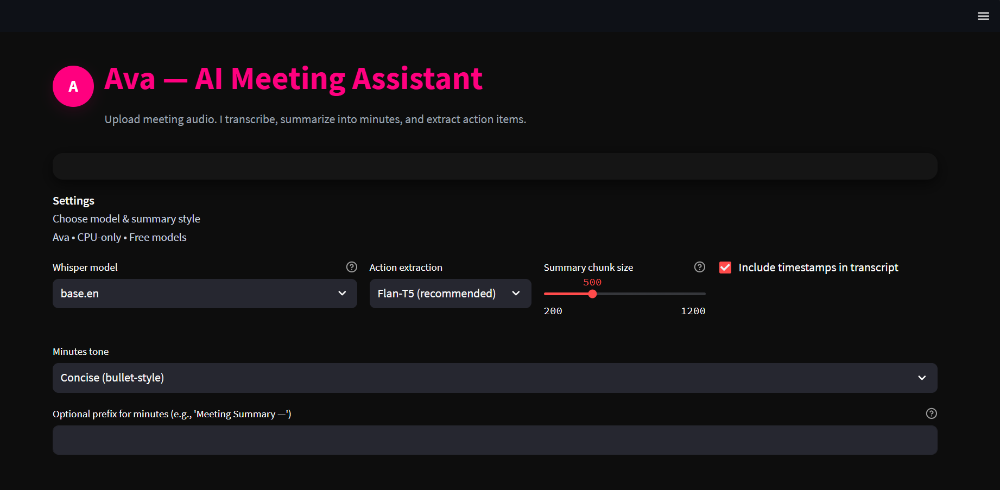
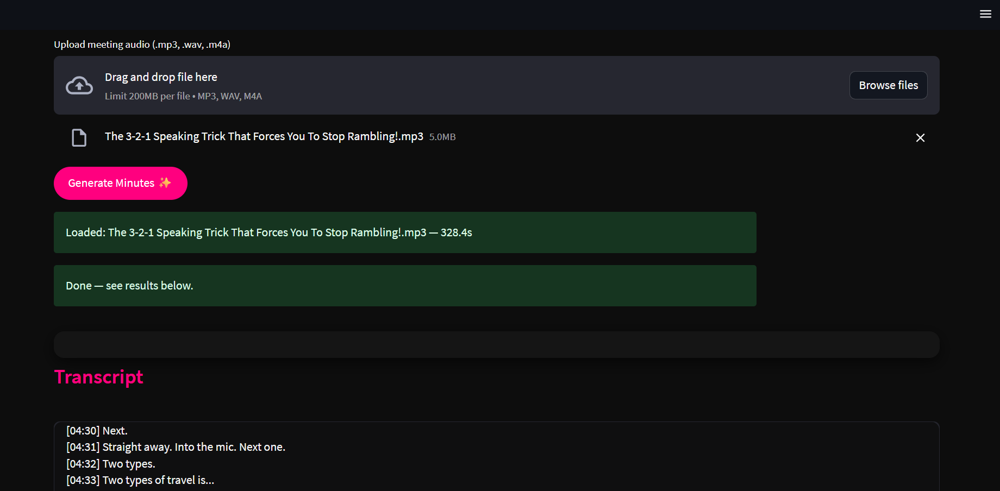
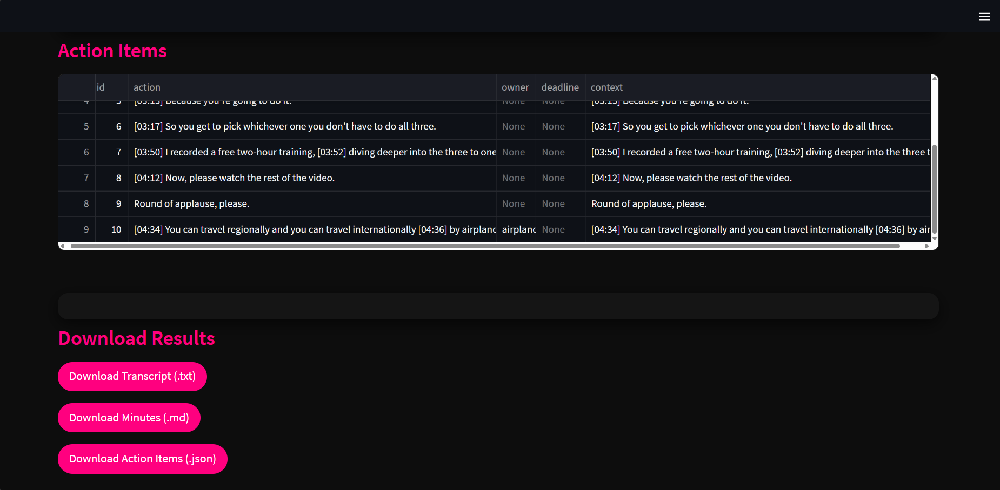

Ava — AI Meeting Assistant 

Upload meeting audio. Ava transcribes, summarizes into clear meeting minutes, 
and extracts action items — all locally on CPU using free, open-source models.

------------------------------------------------------------

 Features

- Audio upload (.mp3, .wav, .m4a) → automatic transcription with Whisper
- Summarization → concise, bullet-style meeting minutes using DistilBART
- Action item extraction → JSON output via Flan-T5, with regex fallback
- Multi-language support (via Whisper models)
- Downloads → transcript (.txt), minutes (.md), actions (.json)
- Modern UI → black & hot-pink Streamlit design
- CPU-only → runs without GPU or paid APIs

------------------------------------------------------------

Screenshots

  
*Choose transcription model, summary style, and options*

---

  
*Upload audio, generate minutes, and track progress*

---

  
*Transcript, summarized minutes, and extracted action items*

------------------------------------------------------------

Tech Stack

- Streamlit → UI
- Whisper → transcription
- Hugging Face Transformers → summarization & action extraction
- PyDub + FFmpeg → audio conversion
- Torch → model backend

------------------------------------------------------------

Quickstart (Local Run)

git clone https://github.com/DivyanshiJ93/Ava-.git  
cd Ava- 
python -m venv venv  
venv\\Scripts\\activate   # Windows  
pip install -r requirements.txt  

Run app:
streamlit run app.py

First run may take a few minutes for model downloads.

------------------------------------------------------------
 Example

Transcript:
Alice: Publish Q3 report by Friday.  
Bob: I'll prepare draft.  
Carol: Review numbers and send feedback by Wednesday.

Action Items:
1. Prepare draft — Owner: Bob — Deadline: Friday
2. Review numbers & feedback — Owner: Carol — Deadline: Wednesday

------------------------------------------------------------

Output Formats

- transcript.txt → raw transcription
- minutes.md → summarized minutes
- action_items.json → structured JSON

------------------------------------------------------------

Future Improvements

- Browser extension for automatic meeting recording
- Larger models for smarter action extraction
- Multi-speaker diarization
- Deployment on Hugging Face Spaces / Streamlit Cloud

------------------------------------------------------------

Disclaimer 

The first run takes a while to run dependencies and set up models . Upload audios less than 30 mins and use tiney.en/tiny models for faster processing . 
